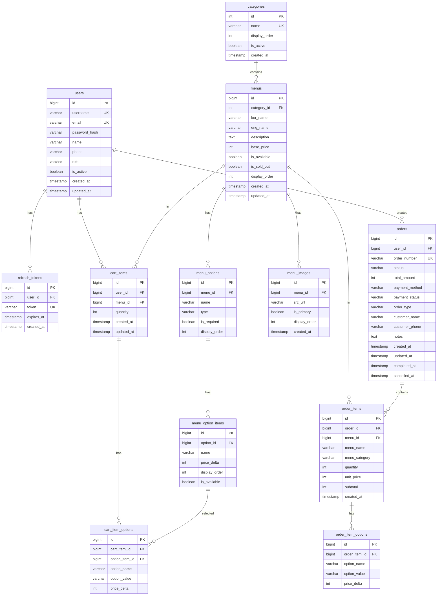

# NCAFE 데이터베이스 재설계 블루프린트 (최종)

> **작성일**: 2026-03-11
> **목적**: 장바구니 기능 및 주문 시스템을 위한 DB 재설계
> **버전**: v2.0 (Full Feature)

---

## 📋 목차

1. [현재 DB 구조](#1-현재-db-구조)
2. [문제점 분석](#2-문제점-분석)
3. [재설계 DB 스키마](#3-재설계-db-스키마)
4. [ERD](#4-erd)
5. [마이그레이션 계획](#5-마이그레이션-계획)

---

## 1. 현재 DB 구조

### 1.1 기존 테이블

#### `categories` (카테고리)
```sql
CREATE TABLE categories (
    id SERIAL PRIMARY KEY,
    name VARCHAR(255) NOT NULL
);
```

#### `menus` (메뉴)
```sql
CREATE TABLE menus (
    id BIGSERIAL PRIMARY KEY,
    kor_name VARCHAR(255),
    eng_name VARCHAR(255),
    description TEXT,
    price INTEGER,
    category_id BIGINT,
    is_available BOOLEAN,
    created_at TIMESTAMP,
    updated_at TIMESTAMP,
    FOREIGN KEY (category_id) REFERENCES categories(id)
);
```

#### `menu_images` (메뉴 이미지)
```sql
CREATE TABLE menu_images (
    id BIGSERIAL PRIMARY KEY,
    menu_id BIGINT,
    src_url VARCHAR(500),
    sort_order INTEGER,
    created_at TIMESTAMP,
    FOREIGN KEY (menu_id) REFERENCES menus(id) ON DELETE CASCADE
);
```

---

## 2. 문제점 분석

### 2.1 누락된 기능 (모두 추가 필요)
- ❌ **사용자/회원 관리**: 현재 사용자 테이블이 없음
- ❌ **주문 시스템**: 주문 및 주문 상세 테이블이 없음
- ❌ **장바구니**: 장바구니는 프론트엔드 Context로만 관리 (로그인 시 유지 불가)

### 2.2 개선 필요 사항 (모두 적용)
- ⚠️ **품절/판매중지 구분**: `is_available`과 `is_sold_out` 분리 필요
- ⚠️ **메뉴 옵션 시스템**: 사이즈, 온도, 추가 옵션 지원
- ⚠️ **결제 정보 관리**: 결제 방법, 결제 상태 추적
- ⚠️ **주문 상태 추적**: 주문 단계별 상태 관리

### 2.3 제외 항목
- ✅ **재고 관리**: 품절 여부(is_sold_out)만으로 충분

---

## 3. 재설계 DB 스키마

### 3.1 사용자 관리

#### `users` (사용자)
```sql
CREATE TABLE users (
    id BIGSERIAL PRIMARY KEY,
    username VARCHAR(50) UNIQUE NOT NULL,
    email VARCHAR(255) UNIQUE NOT NULL,
    password_hash VARCHAR(255) NOT NULL,
    name VARCHAR(100) NOT NULL,
    phone VARCHAR(20),
    role VARCHAR(20) NOT NULL DEFAULT 'USER', -- USER, ADMIN
    is_active BOOLEAN DEFAULT true,
    created_at TIMESTAMP DEFAULT CURRENT_TIMESTAMP,
    updated_at TIMESTAMP DEFAULT CURRENT_TIMESTAMP
);

CREATE INDEX idx_users_username ON users(username);
CREATE INDEX idx_users_email ON users(email);
CREATE INDEX idx_users_role ON users(role);
```

**컬럼 설명:**
- `username`: 로그인 ID (중복 불가)
- `email`: 이메일 (중복 불가, 비밀번호 찾기용)
- `password_hash`: BCrypt 암호화된 비밀번호
- `role`: 권한 (USER: 일반 고객, ADMIN: 관리자)
- `is_active`: 계정 활성화 여부 (탈퇴/정지 처리)

#### `refresh_tokens` (리프레시 토큰)
```sql
CREATE TABLE refresh_tokens (
    id BIGSERIAL PRIMARY KEY,
    user_id BIGINT NOT NULL,
    token VARCHAR(500) UNIQUE NOT NULL,
    expires_at TIMESTAMP NOT NULL,
    created_at TIMESTAMP DEFAULT CURRENT_TIMESTAMP,
    FOREIGN KEY (user_id) REFERENCES users(id) ON DELETE CASCADE
);

CREATE INDEX idx_refresh_tokens_user_id ON refresh_tokens(user_id);
CREATE INDEX idx_refresh_tokens_token ON refresh_tokens(token);
CREATE INDEX idx_refresh_tokens_expires_at ON refresh_tokens(expires_at);
```

**컬럼 설명:**
- `token`: JWT 리프레시 토큰 (중복 불가)
- `expires_at`: 만료 시각 (7일 기본)

---

### 3.2 메뉴 관리 (개선)

#### `categories` (카테고리) - 개선
```sql
CREATE TABLE categories (
    id SERIAL PRIMARY KEY,
    name VARCHAR(100) NOT NULL UNIQUE,
    display_order INTEGER DEFAULT 0,
    is_active BOOLEAN DEFAULT true,
    created_at TIMESTAMP DEFAULT CURRENT_TIMESTAMP
);

CREATE INDEX idx_categories_display_order ON categories(display_order);
CREATE INDEX idx_categories_is_active ON categories(is_active);
```

**추가 컬럼:**
- `display_order`: 카테고리 표시 순서 (작을수록 먼저)
- `is_active`: 카테고리 활성화 여부

#### `menus` (메뉴) - 개선
```sql
CREATE TABLE menus (
    id BIGSERIAL PRIMARY KEY,
    category_id INTEGER NOT NULL,
    kor_name VARCHAR(255) NOT NULL,
    eng_name VARCHAR(255),
    description TEXT,
    base_price INTEGER NOT NULL,
    is_available BOOLEAN DEFAULT true,
    is_sold_out BOOLEAN DEFAULT false,
    display_order INTEGER DEFAULT 0,
    created_at TIMESTAMP DEFAULT CURRENT_TIMESTAMP,
    updated_at TIMESTAMP DEFAULT CURRENT_TIMESTAMP,
    FOREIGN KEY (category_id) REFERENCES categories(id)
);

CREATE INDEX idx_menus_category_id ON menus(category_id);
CREATE INDEX idx_menus_is_available ON menus(is_available);
CREATE INDEX idx_menus_is_sold_out ON menus(is_sold_out);
CREATE INDEX idx_menus_display_order ON menus(display_order);
```

**변경/추가 컬럼:**
- `base_price`: 기본 가격 (옵션 추가 전)
- `is_available`: 판매 가능 여부 (메뉴 자체 활성화)
- `is_sold_out`: 품절 여부 (일시적 품절)
- `display_order`: 메뉴 표시 순서

**상태 조합:**
| is_available | is_sold_out | 의미 |
|-------------|-------------|------|
| true | false | 정상 판매 |
| true | true | 일시적 품절 (주문 불가, 메뉴는 표시) |
| false | false | 판매 중지 (메뉴 숨김) |

#### `menu_images` (메뉴 이미지) - 개선
```sql
CREATE TABLE menu_images (
    id BIGSERIAL PRIMARY KEY,
    menu_id BIGINT NOT NULL,
    src_url VARCHAR(500) NOT NULL,
    is_primary BOOLEAN DEFAULT false,
    display_order INTEGER DEFAULT 0,
    created_at TIMESTAMP DEFAULT CURRENT_TIMESTAMP,
    FOREIGN KEY (menu_id) REFERENCES menus(id) ON DELETE CASCADE
);

CREATE INDEX idx_menu_images_menu_id ON menu_images(menu_id);
CREATE INDEX idx_menu_images_is_primary ON menu_images(is_primary);
```

**변경/추가 컬럼:**
- `is_primary`: 대표 이미지 여부
- `display_order`: 이미지 표시 순서 (sort_order → display_order)

#### `menu_options` (메뉴 옵션 그룹) - 신규
```sql
CREATE TABLE menu_options (
    id BIGSERIAL PRIMARY KEY,
    menu_id BIGINT NOT NULL,
    name VARCHAR(100) NOT NULL, -- '사이즈', '온도', '샷 추가' 등
    type VARCHAR(20) NOT NULL, -- RADIO, CHECKBOX
    is_required BOOLEAN DEFAULT false,
    display_order INTEGER DEFAULT 0,
    FOREIGN KEY (menu_id) REFERENCES menus(id) ON DELETE CASCADE
);

CREATE INDEX idx_menu_options_menu_id ON menu_options(menu_id);
```

**컬럼 설명:**
- `name`: 옵션 그룹명 (예: "사이즈", "온도")
- `type`:
  - `RADIO`: 단일 선택 (예: 사이즈 중 1개)
  - `CHECKBOX`: 다중 선택 (예: 샷 추가, 시럽 추가)
- `is_required`: 필수 선택 여부

**예시:**
```
메뉴: 아메리카노
  옵션 그룹 1: 사이즈 (RADIO, 필수)
    - Regular (+0원)
    - Large (+500원)
  옵션 그룹 2: 온도 (RADIO, 필수)
    - Hot (+0원)
    - Ice (+0원)
  옵션 그룹 3: 추가 옵션 (CHECKBOX, 선택)
    - 샷 추가 (+500원)
    - 바닐라 시럽 (+500원)
```

#### `menu_option_items` (메뉴 옵션 항목) - 신규
```sql
CREATE TABLE menu_option_items (
    id BIGSERIAL PRIMARY KEY,
    option_id BIGINT NOT NULL,
    name VARCHAR(100) NOT NULL, -- 'Regular', 'Large', 'Hot', 'Ice' 등
    price_delta INTEGER DEFAULT 0, -- 추가 가격
    display_order INTEGER DEFAULT 0,
    is_available BOOLEAN DEFAULT true,
    FOREIGN KEY (option_id) REFERENCES menu_options(id) ON DELETE CASCADE
);

CREATE INDEX idx_menu_option_items_option_id ON menu_option_items(option_id);
CREATE INDEX idx_menu_option_items_is_available ON menu_option_items(is_available);
```

**컬럼 설명:**
- `name`: 옵션 항목명 (예: "Regular", "Large")
- `price_delta`: 기본 가격 대비 추가 금액 (음수 가능)
- `is_available`: 옵션 항목 활성화 여부

---

### 3.3 장바구니

#### `cart_items` (장바구니 항목)
```sql
CREATE TABLE cart_items (
    id BIGSERIAL PRIMARY KEY,
    user_id BIGINT NOT NULL,
    menu_id BIGINT NOT NULL,
    quantity INTEGER NOT NULL DEFAULT 1 CHECK (quantity > 0),
    created_at TIMESTAMP DEFAULT CURRENT_TIMESTAMP,
    updated_at TIMESTAMP DEFAULT CURRENT_TIMESTAMP,
    FOREIGN KEY (user_id) REFERENCES users(id) ON DELETE CASCADE,
    FOREIGN KEY (menu_id) REFERENCES menus(id) ON DELETE CASCADE
);

CREATE INDEX idx_cart_items_user_id ON cart_items(user_id);
CREATE INDEX idx_cart_items_menu_id ON cart_items(menu_id);
CREATE UNIQUE INDEX idx_cart_items_user_menu ON cart_items(user_id, menu_id);
```

**컬럼 설명:**
- `quantity`: 수량 (1 이상)
- UNIQUE 제약: 같은 사용자가 같은 메뉴를 여러 번 추가하면 수량만 증가

#### `cart_item_options` (장바구니 항목 옵션)
```sql
CREATE TABLE cart_item_options (
    id BIGSERIAL PRIMARY KEY,
    cart_item_id BIGINT NOT NULL,
    option_item_id BIGINT NOT NULL,
    option_name VARCHAR(100) NOT NULL, -- 스냅샷 (옵션 그룹명)
    option_value VARCHAR(100) NOT NULL, -- 스냅샷 (선택값)
    price_delta INTEGER DEFAULT 0, -- 스냅샷 (추가 금액)
    FOREIGN KEY (cart_item_id) REFERENCES cart_items(id) ON DELETE CASCADE,
    FOREIGN KEY (option_item_id) REFERENCES menu_option_items(id)
);

CREATE INDEX idx_cart_item_options_cart_item_id ON cart_item_options(cart_item_id);
```

**스냅샷 저장 이유:**
- 옵션 데이터가 변경되어도 장바구니에 담긴 항목은 그대로 유지

---

### 3.4 주문 관리

#### `orders` (주문)
```sql
CREATE TABLE orders (
    id BIGSERIAL PRIMARY KEY,
    user_id BIGINT NOT NULL,
    order_number VARCHAR(50) UNIQUE NOT NULL, -- 예: ORD20260311001
    status VARCHAR(20) NOT NULL DEFAULT 'PENDING',
    total_amount INTEGER NOT NULL CHECK (total_amount >= 0),
    payment_method VARCHAR(20), -- CARD, CASH, MOBILE
    payment_status VARCHAR(20) DEFAULT 'UNPAID', -- UNPAID, PAID, REFUNDED
    order_type VARCHAR(20) DEFAULT 'PICKUP', -- PICKUP, DELIVERY
    customer_name VARCHAR(100),
    customer_phone VARCHAR(20),
    notes TEXT,
    created_at TIMESTAMP DEFAULT CURRENT_TIMESTAMP,
    updated_at TIMESTAMP DEFAULT CURRENT_TIMESTAMP,
    completed_at TIMESTAMP,
    cancelled_at TIMESTAMP,
    FOREIGN KEY (user_id) REFERENCES users(id)
);

CREATE INDEX idx_orders_user_id ON orders(user_id);
CREATE INDEX idx_orders_status ON orders(status);
CREATE INDEX idx_orders_order_number ON orders(order_number);
CREATE INDEX idx_orders_created_at ON orders(created_at);
CREATE INDEX idx_orders_payment_status ON orders(payment_status);
```

**주문 상태 (status):**
| 상태 | 설명 |
|-----|------|
| PENDING | 주문 대기 (결제 전) |
| CONFIRMED | 주문 확인 (결제 완료) |
| PREPARING | 제조 중 |
| READY | 제조 완료 (픽업 대기) |
| COMPLETED | 완료 (픽업/배달 완료) |
| CANCELLED | 취소 |

**결제 상태 (payment_status):**
- `UNPAID`: 미결제
- `PAID`: 결제 완료
- `REFUNDED`: 환불 완료

**주문 유형 (order_type):**
- `PICKUP`: 매장 픽업
- `DELIVERY`: 배달

#### `order_items` (주문 항목)
```sql
CREATE TABLE order_items (
    id BIGSERIAL PRIMARY KEY,
    order_id BIGINT NOT NULL,
    menu_id BIGINT NOT NULL,
    menu_name VARCHAR(255) NOT NULL, -- 주문 당시 메뉴명 (스냅샷)
    menu_category VARCHAR(100), -- 주문 당시 카테고리 (스냅샷)
    quantity INTEGER NOT NULL CHECK (quantity > 0),
    unit_price INTEGER NOT NULL, -- 주문 당시 가격 (스냅샷)
    subtotal INTEGER NOT NULL, -- quantity * (unit_price + 옵션 합계)
    created_at TIMESTAMP DEFAULT CURRENT_TIMESTAMP,
    FOREIGN KEY (order_id) REFERENCES orders(id) ON DELETE CASCADE,
    FOREIGN KEY (menu_id) REFERENCES menus(id)
);

CREATE INDEX idx_order_items_order_id ON order_items(order_id);
CREATE INDEX idx_order_items_menu_id ON order_items(menu_id);
```

**스냅샷 저장 이유:**
- 메뉴 가격/이름이 변경되어도 과거 주문 내역은 그대로 유지
- 주문 당시의 정보를 보존하여 정확한 히스토리 관리

#### `order_item_options` (주문 항목 옵션)
```sql
CREATE TABLE order_item_options (
    id BIGSERIAL PRIMARY KEY,
    order_item_id BIGINT NOT NULL,
    option_name VARCHAR(100) NOT NULL, -- 주문 당시 옵션명 (스냅샷)
    option_value VARCHAR(100) NOT NULL, -- 주문 당시 옵션값 (스냅샷)
    price_delta INTEGER DEFAULT 0, -- 주문 당시 추가 금액 (스냅샷)
    FOREIGN KEY (order_item_id) REFERENCES order_items(id) ON DELETE CASCADE
);

CREATE INDEX idx_order_item_options_order_item_id ON order_item_options(order_item_id);
```

**스냅샷 저장 이유:**
- 옵션 가격/이름이 변경되어도 과거 주문 내역은 그대로 유지

---

## 4. ERD



---

## 5. 마이그레이션 계획

### 5.1 Phase 1: 코어 테이블 (즉시 구현)
1. ✅ `users` - 사용자 관리
2. ✅ `refresh_tokens` - 인증 토큰
3. ✅ `categories` - 카테고리 (개선)
4. ✅ `menus` - 메뉴 (개선)
5. ✅ `menu_images` - 메뉴 이미지 (개선)

### 5.2 Phase 2: 옵션 & 장바구니 (즉시 구현)
6. ✅ `menu_options` - 메뉴 옵션 그룹
7. ✅ `menu_option_items` - 옵션 항목
8. ✅ `cart_items` - 장바구니
9. ✅ `cart_item_options` - 장바구니 옵션

### 5.3 Phase 3: 주문 시스템 (즉시 구현)
10. ✅ `orders` - 주문
11. ✅ `order_items` - 주문 상세
12. ✅ `order_item_options` - 주문 옵션

### 5.4 실행 순서

#### Step 1: 배포 서버 DB 백업 (안전장치)
```bash
# 혹시 모를 사고를 대비한 백업
docker exec yj-dev-db pg_dump -U ncafe -d ncafedb > backup_$(date +%Y%m%d_%H%M%S).sql
```

#### Step 2: 기존 테이블 스키마 수정
```sql
-- categories 테이블 개선
ALTER TABLE categories ADD COLUMN IF NOT EXISTS display_order INTEGER DEFAULT 0;
ALTER TABLE categories ADD COLUMN IF NOT EXISTS is_active BOOLEAN DEFAULT true;
ALTER TABLE categories ADD COLUMN IF NOT EXISTS created_at TIMESTAMP DEFAULT CURRENT_TIMESTAMP;
ALTER TABLE categories ADD CONSTRAINT categories_name_unique UNIQUE (name);

-- menus 테이블 개선
ALTER TABLE menus RENAME COLUMN price TO base_price;
ALTER TABLE menus ADD COLUMN IF NOT EXISTS is_sold_out BOOLEAN DEFAULT false;
ALTER TABLE menus ADD COLUMN IF NOT EXISTS display_order INTEGER DEFAULT 0;

-- menu_images 테이블 개선
ALTER TABLE menu_images ADD COLUMN IF NOT EXISTS is_primary BOOLEAN DEFAULT false;
ALTER TABLE menu_images RENAME COLUMN sort_order TO display_order;
```

#### Step 3: 신규 테이블 생성
```bash
# init-db-v2.sql 실행
docker exec -i yj-dev-db psql -U ncafe -d ncafedb < init-db-v2.sql
```

#### Step 4: 초기 데이터 입력
```bash
# 카테고리 및 메뉴 샘플 데이터
docker exec -i yj-dev-db psql -U ncafe -d ncafedb < data-v2.sql
```

---

## 6. 구현 우선순위

### 🔴 Phase 1 (즉시 구현 - 기본 기능)
- ✅ `users` - 로그인/회원가입
- ✅ `refresh_tokens` - JWT 인증
- ✅ `cart_items` - 장바구니
- ✅ `orders` / `order_items` - 주문 기능

### 🟡 Phase 2 (즉시 구현 - 향상된 기능)
- ✅ `menu_options` / `menu_option_items` - 사이즈/온도/옵션
- ✅ `cart_item_options` / `order_item_options` - 옵션 주문

### 🟢 Phase 3 (추후 구현)
- ⏸️ 쿠폰/할인 시스템
- ⏸️ 리뷰/평점 시스템
- ⏸️ 포인트/적립금 시스템

---

## 7. 다음 단계

### 즉시 진행:
1. ✅ 블루프린트 검토 및 승인
2. ⬜ `init-db-v2.sql` 작성 (DDL 스크립트)
3. ⬜ `data-v2.sql` 작성 (샘플 데이터)
4. ⬜ Backend Entity 클래스 생성/수정
5. ⬜ Repository 계층 구현
6. ⬜ Service 계층 구현
7. ⬜ API 엔드포인트 구현
8. ⬜ Frontend 연동

---

## 8. 주요 개선사항 요약

### ✅ 모든 누락 기능 추가
- 사용자/회원 관리 시스템
- 서버 기반 장바구니 (로그인 시 유지)
- 주문 시스템 (상태 추적)

### ✅ 모든 개선 사항 적용
- 품절/판매중지 구분 (`is_available` + `is_sold_out`)
- 메뉴 옵션 시스템 (사이즈, 온도, 추가 옵션)
- 결제 정보 관리 (결제 방법, 결제 상태)
- 주문 상태 추적 (PENDING → CONFIRMED → PREPARING → READY → COMPLETED)
- 과거 데이터 보존 (스냅샷 방식)

### ❌ 제외 항목
- 재고 관리 시스템 (품절 여부만으로 충분)

---

**작성자**: Claude (AI Assistant)
**상태**: 최종 승인 대기
**다음 작업**: `init-db-v2.sql` 및 `data-v2.sql` 생성
